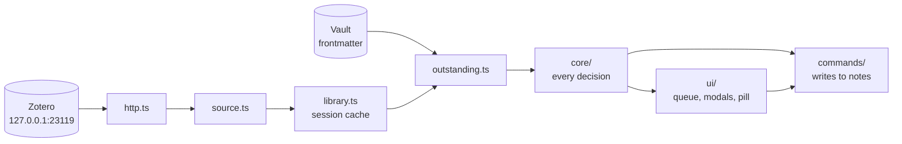

# Architecture

Paper Trail is a view over two sources of truth: what Zotero holds, and what the
notes in the vault say. It keeps no state of its own beyond its settings.

## Where state lives

- **The notes are the record.** Every decision is frontmatter and a tag on the
  paper's note. The queue, the block and the pill are all derived from them on
  every draw, and if one of them disagrees with a note, the note wins.
- **Zotero is read, never written.** What it said is held in memory for the
  length of a session (`src/library.ts`) and never written to disk.
- **Nothing caches vault state across sessions.**

## Layers

| Path | What it holds |
| --- | --- |
| `src/core/` | Every decision. Pure: no Obsidian imports except type-only ones, no filesystem. This is what the tests cover. |
| `src/commands/` | Wiring that writes: decisions onto notes, notes from Zotero items, citations into the editor, the report. |
| `src/ui/` | Wiring that draws: the queue view, the block, the modals, the pill, the editor extension that draws the prompts. |
| `src/http.ts` | The one place a request is made. See [Zotero](zotero.md) for why it does not use `requestUrl`. |
| `src/source.ts` | Every request to Zotero, and whether the last one was answered. |
| `src/library.ts` | What Zotero said, kept for the session and brought up to date by asking what changed. |
| `src/outstanding.ts` | Joins the library to the vault. Composes rules from `core/stages.ts` and adds none of its own. |
| `src/context.ts` | `Context`: app, settings and `saveSettings`, which is all a command gets. |
| `src/main.ts` | Registers the view, the commands, the menus and the events. |

## Rules for where code goes

**Every decision belongs in `core/`.** If something in `commands/` or `ui/` is
deciding rather than wiring, it is in the wrong file. Three of the first four
bugs in this plugin were decisions stranded in the untested layer. A function
outside `core/` that could be tested by passing it plain objects wants moving.

**Commands take a `Context`, never the plugin class.** Only the settings tab
needs the real `Plugin`. A command that took the plugin could reach anything,
would depend on `main.ts` while `main.ts` depends on it, and could not be called
from a test.

**Every file in `core/` has a test named after it.** Outside `core/`, only
`source.ts` and `library.ts` do, both with Zotero mocked. Nothing in `commands/`
or `ui/` has a test, and a file there that wants one is a decision in the wrong
layer.

**No two source files share a basename.** Two files called `workflow.ts` once
made a coverage script report the untested one as tested.

**One definition of the vocabulary.** `src/core/triage.ts` is the only place the
`reading` values, their order, their icons and their words are written.

**One place a state changes.** `writeTriage` in `src/commands/reading.ts` writes
every decision, which is why it is also where the Claim and Assessment headings
are written in.

## How the queue is drawn

1. The view draws at once from what `library.ts` already holds, so it is never
   empty while waiting on Zotero.
2. It asks Zotero what changed since the library version it last saw. That is
   one request, and it almost always answers with nothing.
3. If anything changed, `library.ts` tells every view drawing the library, the
   sidebar and any block in a note, and they redraw.
4. Each draw reads every paper note's frontmatter through Obsidian's metadata
   cache, joins it to the library in `outstanding.ts`, and sorts the result into
   stages with `core/stages.ts`.

The catch-up in step 2 runs when the view opens and whenever the Obsidian window
gets focus, debounced. Coming back to Obsidian is the moment you have just saved
something in the browser.

Every rule that decides what is outstanding takes a `Workflow` (whether triage
is on, and which written passes) as a required argument, so no call site can
quietly assume a mode.
